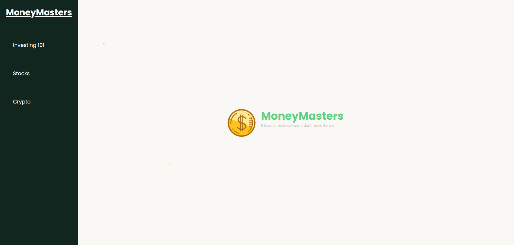

# MoneyMasters

## Welcome to MoneyMasters!

Interested in becoming financially free? Look no further! We offer a wide range of educational outlets here at MoneyMasters!

### How to use -

To get started, simply browse through what topic interests you the most. We have some reliable YouTube channels to scroll through, as well as an overview of each topic!

If you like what you see, feel free to subscribe to our newsletter where we send out weekly financial gains and current events. If you'd like to see if your email has been stored correctly, simply press F12 and navigate to the "Application" window in the developer console where you'll find the Local Storage tab. There, you will be able to see if your email has been stored! We have a 100% customer subscription rate!

Thanks for checking us out!

[Live website here!](https://drewheaster.github.io/financial-literacy/)